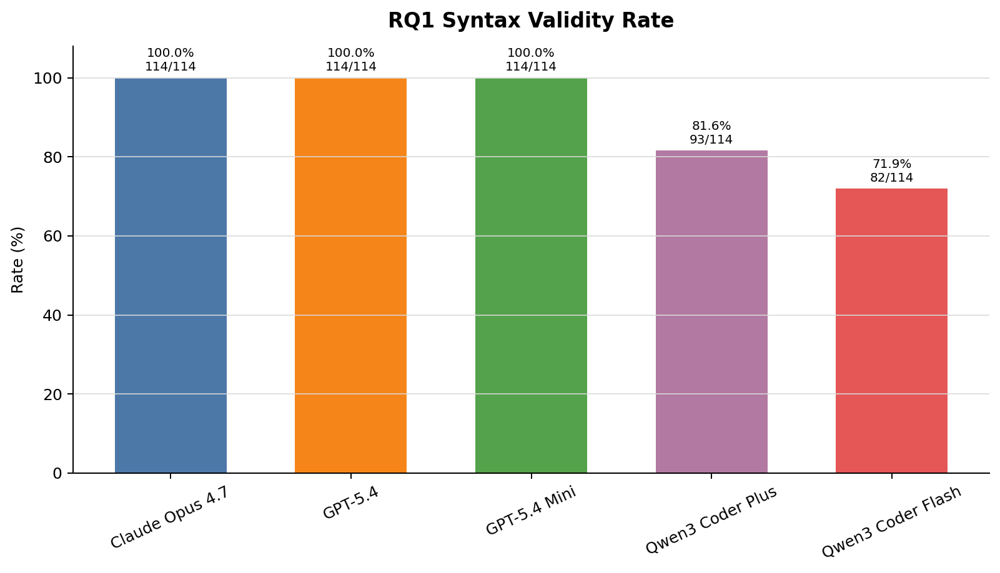
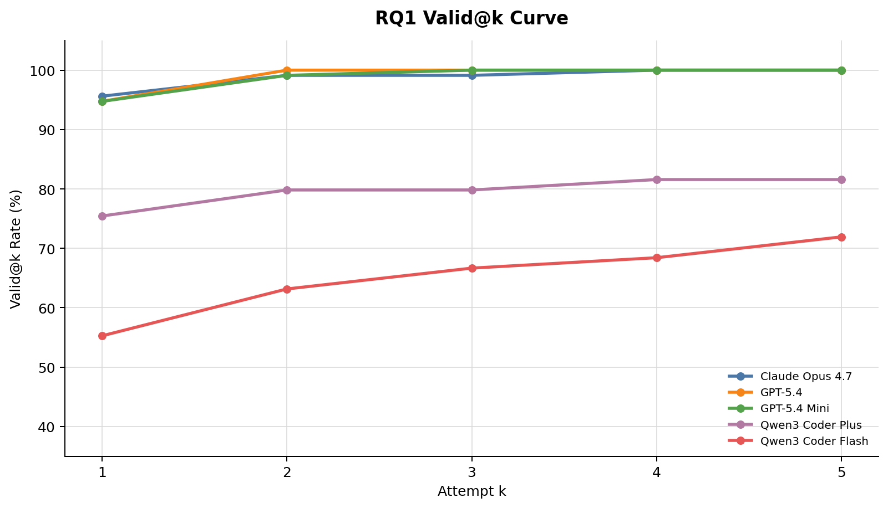
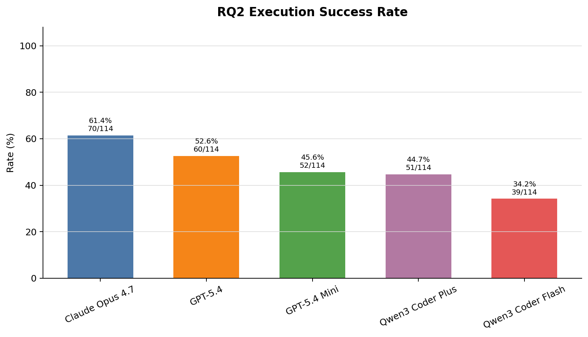
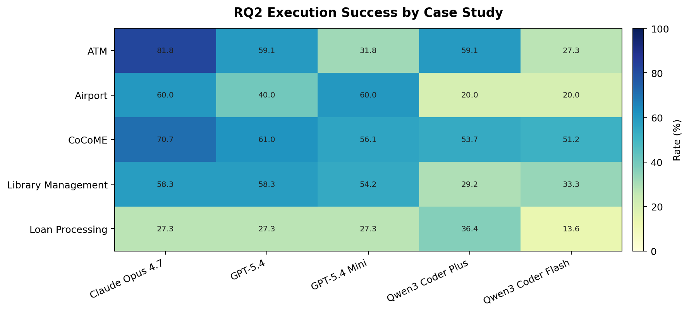
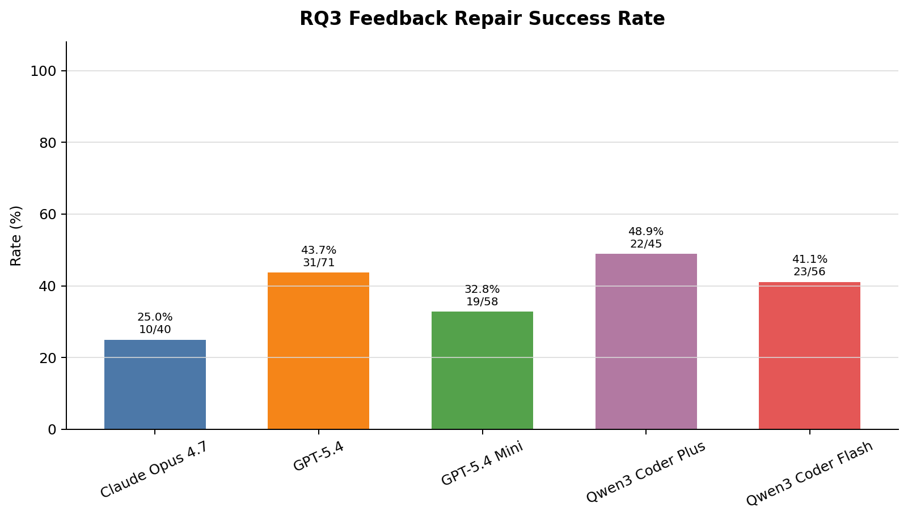
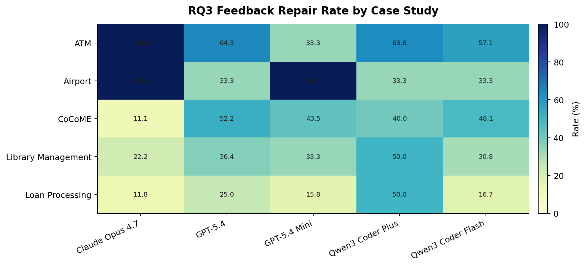

# RQ1-RQ3 Analysis Report

## Figure Format

- All figures use PNG format, 180 dpi, white background.
- Percentage metrics use 0-100% y-axis where possible.
- Model colors are consistent across all figures.
- Bar labels show percentage and count, e.g. `70/114`.
- `rq1_valid_at_k_curve.png` is the main curve chart for Valid@k.

## RQ1 Syntax Validity

| model | total_operations | syntax_valid_count | non_syntax_valid_count | syntax_validity_rate |
| --- | --- | --- | --- | --- |
| Claude Opus 4.7 | 114 | 114 | 0 | 100.0 |
| GPT-5.4 | 114 | 114 | 0 | 100.0 |
| GPT-5.4 Mini | 114 | 114 | 0 | 100.0 |
| Qwen3 Coder Plus | 114 | 93 | 21 | 81.5789 |
| Qwen3 Coder Flash | 114 | 82 | 32 | 71.9298 |

## RQ2 Execution Success

| model | total_operations | execution_success_count | non_execution_success_count | execution_success_rate |
| --- | --- | --- | --- | --- |
| Claude Opus 4.7 | 114 | 70 | 44 | 61.4035 |
| GPT-5.4 | 114 | 60 | 54 | 52.6316 |
| GPT-5.4 Mini | 114 | 52 | 62 | 45.614 |
| Qwen3 Coder Plus | 114 | 51 | 63 | 44.7368 |
| Qwen3 Coder Flash | 114 | 39 | 75 | 34.2105 |

## RQ3 Feedback Utility

| model | total_operations | operations_with_intermediate_errors | repaired_after_feedback_count | unrepaired_after_feedback_count | repair_success_rate | avg_repair_rounds | avg_intermediate_errors |
| --- | --- | --- | --- | --- | --- | --- | --- |
| Claude Opus 4.7 | 114 | 40 | 10 | 30 | 25.0 | 1.7368 | 0.7368 |
| GPT-5.4 | 114 | 71 | 31 | 40 | 43.662 | 2.3421 | 1.3421 |
| GPT-5.4 Mini | 114 | 58 | 19 | 39 | 32.7586 | 2.9737 | 1.9737 |
| Qwen3 Coder Plus | 114 | 45 | 22 | 23 | 48.8889 | 2.0175 | 1.2018 |
| Qwen3 Coder Flash | 114 | 56 | 23 | 33 | 41.0714 | 2.6228 | 1.9035 |

